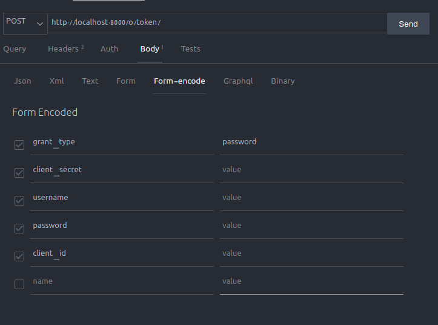

## employee vaccination

proyecto desarrollado en Python con DJango rest framework.

**Contrucción:**

1. Se inicio un proyecto en django con el comando `django-admin start project employee_vaccination`
2. Se creo una app de django con el comando `django-admin startapp core`
3. Se creo una base de datos de PostgreSQL
4. En el archivo settings.py  Se configuro la conexión a la base de datos
5. dentro de la app llamada core, en el archivo models.py empezamos a declarar los modelos necesarios para realizar las operaciones de la base de datos
6. Dentro de la misma app, creamos una carpeta views para poder dividir nuestras vistas por modelos creados
7. creamos nuestras vistas necesario
8. adiccionalmente agregamos algunas clases y metodos necesarios para su funcionamiento, Serializers, Permissions, Utils, etc.
9. Crearmos el Custom Permission (UserPermission) para que usuario tenga acceso al endpoint de acuerdo al permiso
10. crearmos nuestras rutas dentro de urls.py

**Despliegue:**

1. Crear una base de PostgreSQL vacía
2. Configurar la conexión a la misma en el archivo settings.py
3. en el mismo archivo configurar las variables EMAIL_HOST,EMAIL_PORT, EMAIL_HOST_USER,EMAIL_HOST_PASSWORD para el envío de correos
4. Crear el ambiente virtual en el caso de linux con el comando `virtualenv -p python3.8 venv `
   y para windows `python -m virtualenv venv`
5. Activar el ambiente virtual LInux `source venv/bin/activate `
   y para windows `.\venv\Scripts\activate`
6. Una vez activado el ambiente virtual se procede a instalar las dependencias con `pip install -r requirements.txt`
7. Una ve tengamos lista la conexión a nuestra base de datos, ejecutamos `python3 manage.py migrate`
   para aplicar las migraciones
8. Cargamos los datos iniciales con el comando `python manage.py loaddata init.json`
9. Crear un super usuario para poder acceder con el comando `python3 manage.py createsuperuser`
10. Una vez crear el usuario iniciamos el servidor con `python3 manage.py runserver`
11. Para este caso usamos Auth2.0 por lo que necesitamos crear un client_id y un client_secret, accedemos desde el navegador a http://localhost:8000/admin
12. Ingresamos con el usuario y contraseña que creamos en el paso numero 7
13. Creamos una aplicación en la ruta http://localhost:8000/admin/oauth2_provider/application/add/ ; Client type debe quedar en confidential, Authorization grant type con el valor de Resource owner password-based; antes de guardar copiamos el client_id y secret id.
14. Realizamos una peticion POST como se ve en la imagen, ingresando los valores de cliente_secret, username, password, client_id
15. para revisar la documentación en swagger ingrese a http://localhost:8000/docs/
    
